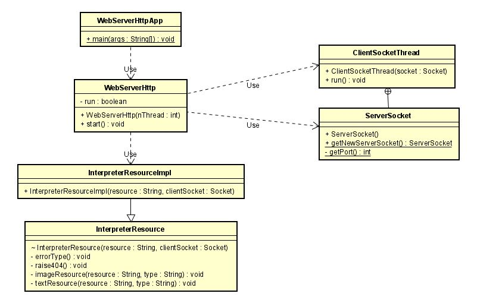
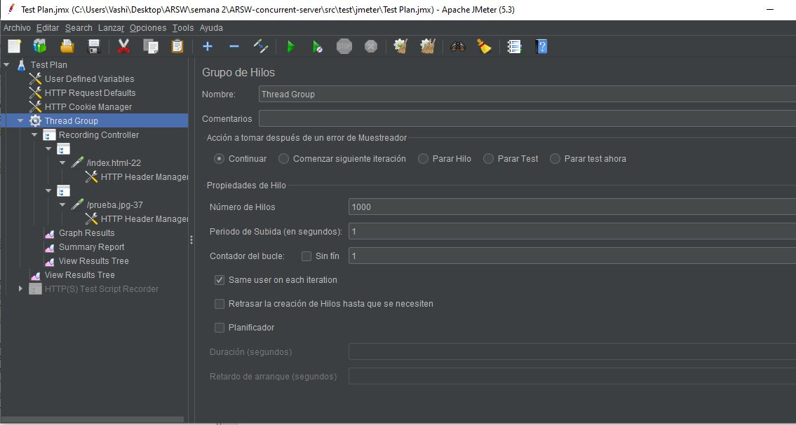
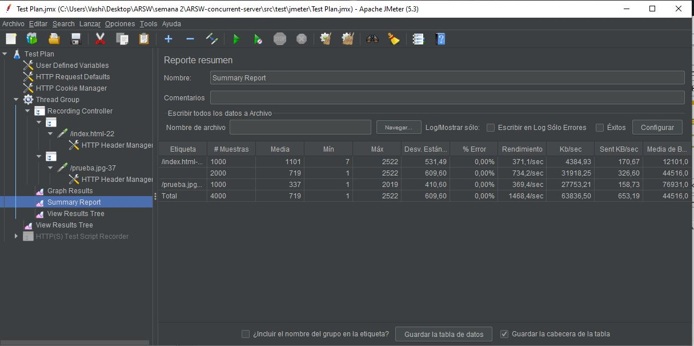
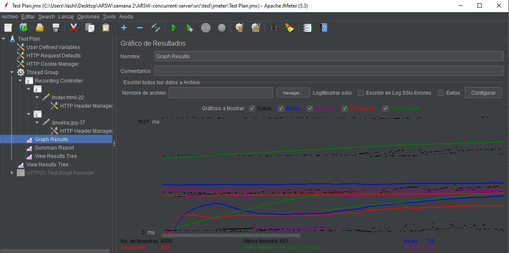

# ARSW-Concurrent Server

Escriba un servidor web que soporte múltiples solicitudes seguidas (concurrentes). El servidor debe retornar todos los archivos solicitados, incluyendo
páginas html e imágenes. 

# Link funcional  app montada en heroku

* [Prueba con una plantilla Bootstrap](https://concurrent-server-arsw.herokuapp.com/index.html)
* [Prueba con una imagen](https://concurrent-server-arsw.herokuapp.com/prueba.jpg)


## Prerequisitos

Tener instalado Java jdk versiones 7+, Maven comandos, git y JMeter 3.1.0

# Documentación

la documentacion de este proyecto esta en la siguiente ruta del proyecto:

```
raiz /documentation
```

2.(opcional): si requiere la documentacion del codigo ejecute y estara en raiz /target/site/apidocs:

```
mvn javadoc:javadoc
```

# Empezar

cargue las  dependencias:

```
mvn package
```

ejecute el servidor:

```
java -cp target/classes edu.escuelaing.arsw.servidorWeb.WebServerHttpApp
```

haga la solicitud a su navegador ingresando la siguiente url:

```
http://localhost:4567/index.html
```


## Diseño

<p align="center">
    
</p>

# Pruebas con JMeter

compilar packetes de maven con:

```
mvn package
```

compilar GUI de Jmeter con:

```
mvn jmeter:configure jmeter:gui
```

exportar la plantilla .xml que esta en src/test/jmeter

## Prueba con 1000 usuario haciendo peticiones al servidor 

### configuracion:

<p align="center">
    
</p>

## Tabla de resultados

<p align="center">
    
</p>

## grafica de rendimiento

<p align="center">
    
</p>


# Built con

* [Maven](https://maven.apache.org/) - Dependency Management
* [JAVA JDK 8](http://www.oracle.com/technetwork/java/javase/overview/index.html) - construcción
* [JMeter 3.1.0](https://github.com/jmeter-maven-plugin/jmeter-maven-plugin) - Test Dependency


# Autor

* **ANDRES DAVID VASQUEZ IBAÑEZ** - *Initial work* - [VASHIGO](https://github.com/vashigo)

# Bibliografia

* [Pruebas basicas Jmeter](https://sdos.es/blog/pruebas-de-rendimiento-con-jmeter-ejemplos-basicos) 

* [Configurar Jmeter con Maven](https://stackoverflow.com/questions/44903877/how-to-set-jmeter-home-in-pom-xml) 

